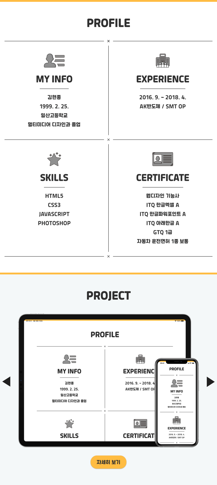

# Portfolio

## 설명

- 포트폴리오의 생동감을 위해 CSS의 키프레임을 활용하여 약간의 애니메이션 효과를 주었습니다.
- 프로젝트 부분은 슬라이더 기능을 사용하여 한 프로젝트씩 넘기면서 볼 수 있도록 하였습니다.
- PC, 태블릿, 모바일등 서로 다른 기기에서도 원활히 볼 수 있도록 반응형으로 제작하였습니다.
- **[사이트로 이동](https://990225.github.io/)**

## 주요 기능

- 슬라이더
- 모달

## 스크린샷

